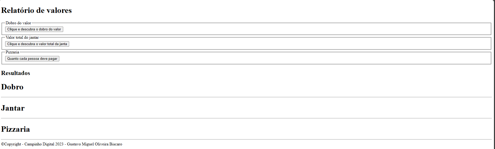
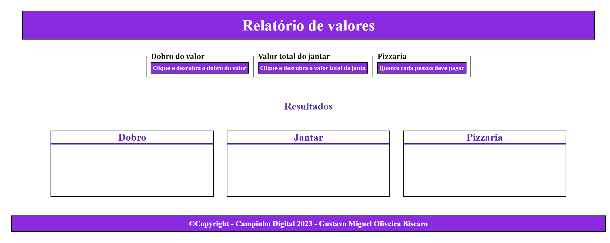

## EXPLICANDO A IDEIA DO PROJETO

## Índice

- [HTML](#HTML)
  - [Contextualzando](#ExplicaHTML)
- [CSS](#CSS)
  - [Explicação](#ExplicaCSS)
- [Git e GitHub:](#GIT-GITHUB)
  - [Explicação](#ExplicaGit)
- [Javascript](#JAVASCRIPT)
  - [Explicação](#ExplicaJS)
- [Como linkei o HTML com o JavaScript:](#Ligação)
  - [Explicação](#LINK)

***

## HTML

### Contextualizando

Basicamente tentei assimilar várias funções distintas numa mesma tela, para que de algum modo, elas em conjunto fossem trazer um resultado dinâmico e objetivo.
O primeiro passo foi definir um **main** e deixá-lo como o box central de todo projeto. E o principal foi definir um **box model** apropriado para o projeto, então eu pensei logo num formulário que poderia ser como ponte para aplicar o projeto. Para isso utilizei a tag **form** junto ao **legend** e um **button** para cada aplicação específica.

###### Imagem 1.0 - Esqueleto #######

## CSS

### Explicação

  Basicamente o visual da aplicação. Me preocupei com a estética obviamente, mas pensei em utilizar um display para deixar cada caixa bem distribuída do jeito que me agrada, então utilizei o display **block** , como também o display flex, conhecido também como **flexbox**, mas somente para deixar uma visualização menos poluída para o usuário final.

###### Imagem 2.0 - Com a estilização praticamente finalizada ######

## GIT-GITHUB

### Explicação

Para praticar todo conceito, eu fiz o forkei, conforme instruído. Após isso, na pasta forkada, criei uma branch, mesmo sendo uma pasta minha e após fazer todas alterações nessa árvore secundária, eu fiz um pull request para "solicitar" uma possível alteração, como não havia nada, não deu conflito e passou.

### Para forkar

1. Fork um repositório (de outro usuário) que você deseja contribuir
https: // github.com/ [OUTRO-USUÁRIO]/ [REPOSITÓRIO]

2. Clone seu repositório ‘forkado’ com seu nome de usuário
git clone https://github.com/[SEU-USUÁRIO]/[REPOSITÓRIO]

### Para criar uma branch
1. git checkout -b nomeBranch
2. git commit -m "Minha nova Branch"
3. git push --set-upstream origin nomeBranch

## Para sair da branch ou saber qual branch está

#### git branch
O próprio terminal informa qual branch você está
#### git chechout master 
Para voltar para a branch principal, ou outra, caso houver

#### Pull Request
Não era necessário, mas fiz um pull request no meu próprio repositório e após isso, fiz um merge. Indo no próprio repositório executando a opção de pull request e realizar o merge, que neste caso é apenas uma ramificação.

## JAVASCRIPT
Para resolver, fui exercício por exercício, na verdade, antes mesmo de começar tudo, eu já fiz as soluções como funções através do **function** para que elas fossem acionadas somente quando eu quisesse.

## LINK
Existem maneiras de se fazer isso, no meu caso utilizei o evento "on click" do javascript, em que as funções são acionadas com um clique e com isso disparar um evento para realização das lógicas do programa. Para aparecer de fato no HTML, foi necessário pegar o id de cada elemento e atribuir seu valor no campo determinado, como neste caso, nas **divs**

